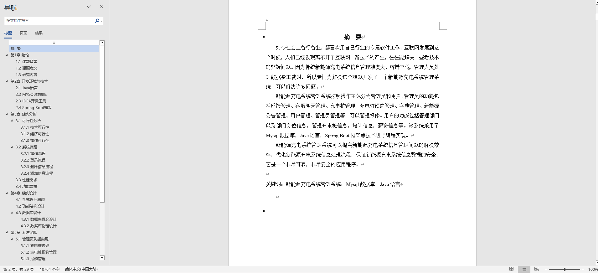
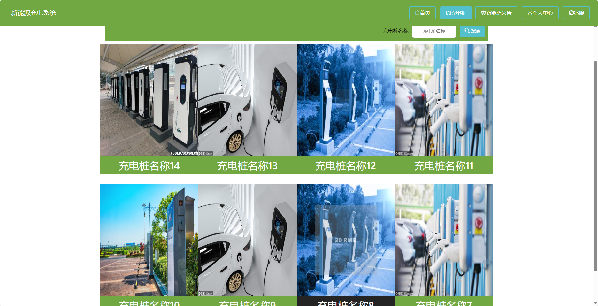
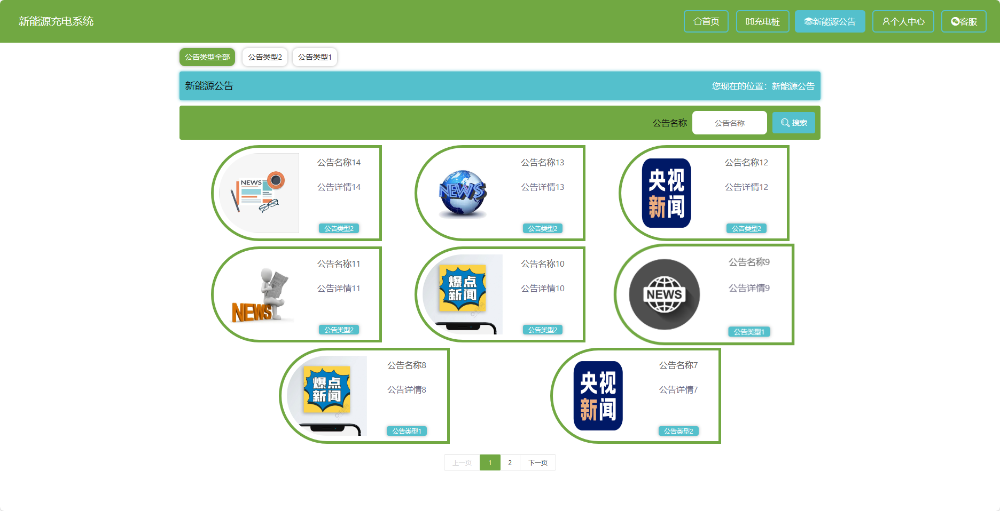
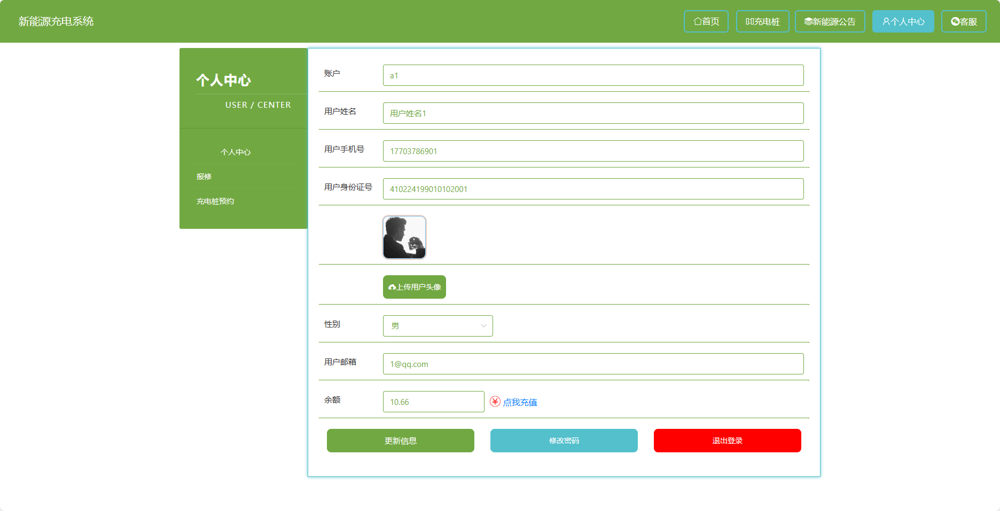
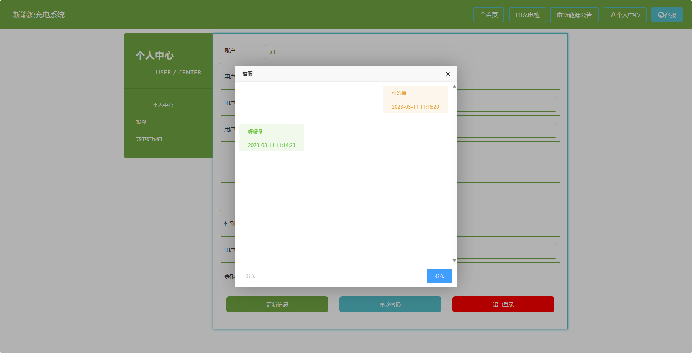
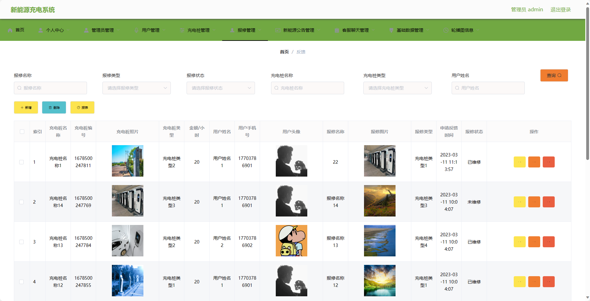

## 基于SpringBoot的新能源充电系统(程序+报告)

- <b>完整代码获取地址：从戎源码网 ([https://armycodes.com/](https://armycodes.com/))</b>
- <b>技术探讨、资料分享，请加QQ群：692619798</b> 
- <b>作者微信：19941326836  QQ：952045282</b> 
- <b>承接计算机毕业设计、Java毕业设计、Python毕业设计、深度学习、机器学习</b>
- <b>选题+开题报告+任务书+程序定制+安装调试+论文+答辩ppt 一条龙服务</b>
- <b>所有选题地址 ([https://github.com/YuLin-Coder/AllProjectCatalog](https://github.com/YuLin-Coder/AllProjectCatalog)) </b>

## 项目介绍
基于SpringBoot的新能源充电系统，系统包含两种角色：管理员、用户,系统分为前台和后台两大模块，主要功能如下。

### 【管理员】：
- 个人中心：管理员可以查看和编辑个人信息。
- 管理员管理：管理员可以对其他管理员进行管理，包括添加、编辑和删除管理员账号。
- 用户管理：管理员可以管理用户账号，包括查看用户信息、禁用用户账号等操作。
- 充电桩管理：管理员可以管理系统的充电桩信息，包括添加、编辑和删除充电桩。
- 报修管理：管理员可以处理用户报修请求，查看和审核充电桩的故障情况，并安排维修。
- 新能源公告管理：管理员可以发布和管理系统的新能源公告信息，包括添加、编辑和删除公告。
- 客服聊天管理：管理员可以与用户进行在线聊天和咨询，解答用户的问题和提供技术支持。
- 基础数据管理：管理员可以管理系统的基础数据，包括充电桩类型、区域等信息的添加、编辑和删除。
- 轮播图信息：管理员可以管理首页的轮播图信息，包括添加、编辑和删除轮播图。

### 【前台】：
- 合首页：展示系统的概述和主要功能入口。
- 充电桩：提供查找附近充电桩的功能，用户可以查看充电桩的位置、类型和空闲情况。
- 新能源公告：管理员发布的新能源相关公告和重要通知信息。
- 个人中心：用户可以查看和编辑个人信息，包括账号、充电记录等。

## 项目技术
- 编程语言：Java
- 数据库：MySQL
- 项目管理工具：Maven
- 前端技术：HTML、CSS、JavaScript、Jquery、Vue
- 后端技术：Spring、SpringMVC、MyBatis

## 运行环境
- JDK版本：JDK1.8及以上
- 开发工具：IDEA、Ecplise、Myecplise都可以
- 数据库: MySQL5.7及以上
- Maven：maven3.0及以上
- Node：14.14.0及以上

## 运行截图

